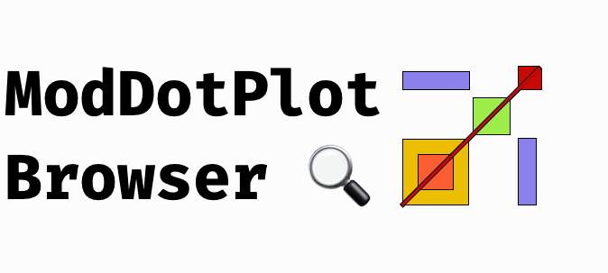

# ModDotPlot Browser

`ModDotPlot Browser` is a web-based, interactive genomic dotplot viewer designed to visualize entire chromosomes in *seconds*. Input data remain local to your web browser and are not stored in any database or server.

**Live application:** [marbl.github.io/ModDotPlot-Browser](https://marbl.github.io/ModDotPlot-Browser/)

> **Note:** This project was generated by ChatGPT 5.6 Sol under the direction of Adam Phillippy and Alex Sweeten. It is intended to be used for exploratory purposes only. For analyses intended for publication, please use the official [ModDotPlot CLI](https://github.com/marbl/ModDotPlot) and cite the [ModDotPlot paper](https://doi.org/10.1093/bioinformatics/btae493).

## Documentation

* [Tutorial/User Guide](docs/USER_GUIDE.md)
* [Local/HPC Cluster Deployment](docs/DEPLOYMENT.md)
* [Methods](docs/METHODS.md)
* [Privacy & Data Handling](docs/PRIVACY.md)
* [Citation and method credits](docs/CITATIONS.md)
* [Release checklist](docs/RELEASE_CHECKLIST.md)

## Citation, authorship, and license

Users of `ModDotPlot Browser` are requested to cite the original ModDotPlot paper: Sweeten AP, Schatz MC,
Phillippy AM. *ModDotPlot-rapid and interactive visualization of tandem repeats*.
Bioinformatics. 2024;40(8):btae493.
[doi:10.1093/bioinformatics/btae493](https://doi.org/10.1093/bioinformatics/btae493).

Structured software and method credits are in [CITATION.cff](CITATION.cff).

`ModDotPlot Browser` is released under [MIT-0](LICENSE).
