# ModDotPlot Browser User Guide & Tutorial

> **Note:** This project was generated by ChatGPT 5.6 Sol under the direction of Adam Phillippy and Alex Sweeten. For analyses intended for publication, please use the official [ModDotPlot CLI](https://github.com/marbl/ModDotPlot) and cite the [ModDotPlot paper](https://doi.org/10.1093/bioinformatics/btae493).

## Getting started

`ModDotPlot Browser` has been tested and works on current versions of Google Chrome, Microsoft Edge, Mozilla Firefox, and Safari. Web browsers must have WebAssembly, Web Workers, and WebGL2 enabled. Mobile browsers appear to be compatible, although navigating plots with touchscreen controls may be more challenging.

There is no fixed input-size limit because files are processed locally rather than uploaded. The practical limit depends on available system memory and browser WebAssembly constraints. As a reference, the approximately 6 GB HG002 diploid human genome uses about 830 MB of browser memory at the default settings.

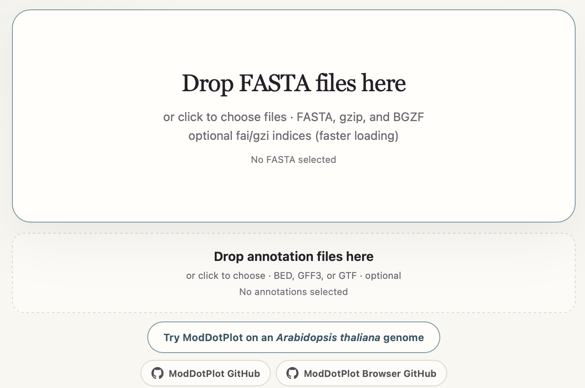

To get started, simply drop one or more plain, gzip-compressed, or BGZF FASTA assembly files on the large FASTA target, or use its file chooser. BGZF is detected from its header even when the suffix is `.gz`. For indexed loading, include `sample.fa.fai` with `sample.fa`, or include both `sample.fa.gz.fai` and `sample.fa.gz.gzi` with a BGZF `sample.fa.gz`:

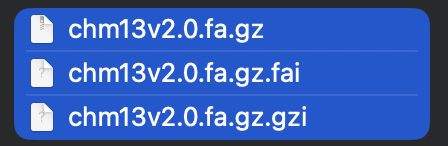

ModDotPlot will index and validate the provided assembly and, upon completion, create an `Explore` button that launches the interactive browser. You can optionally add BED, GFF, or GTF annotation files on the smaller annotation target. Make sure their sequence identifiers match the corresponding FASTA headers.


The following tutorial will use the provided *Arabidopsis thaliana* genome assembly from [Naish *et al.* 2021](https://doi.org/10.1126/science.abi7489).

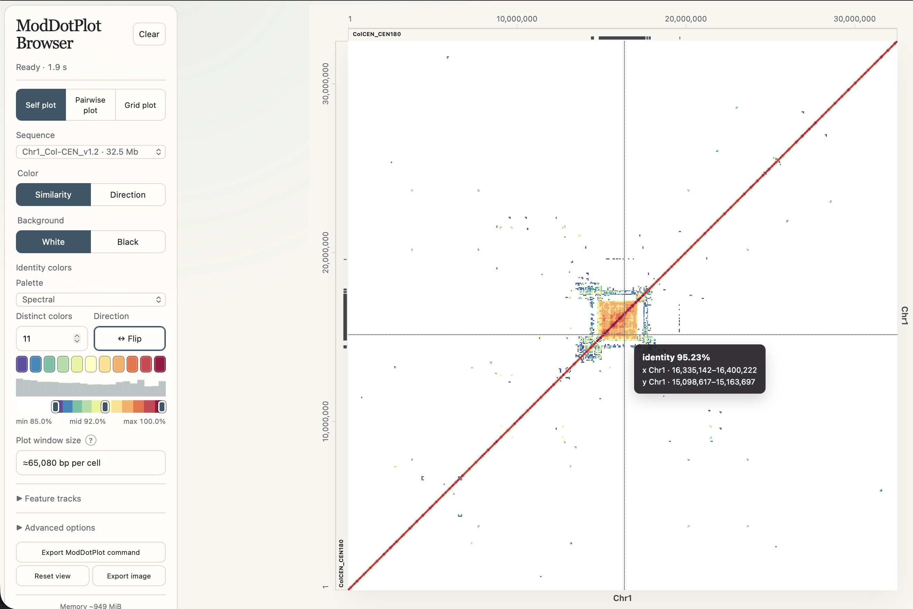

## Plot Navigation

To navigate an interactive plot:

- Scroll with a mouse wheel or trackpad to zoom around the pointer.
- Click and drag to pan across the plot.
- Select `Reset view` to return to the complete plot, and `Clear` to return back to the landing page.

Zooming is limited to a minimum visible interval of approximately 100 bp on each eligible axis. At the closest zoom levels, the browser switches to exact *k*-mer rendering. The default exact view colors matching cells by nucleotide base, while the `Identity` option applies the selected identity palette.

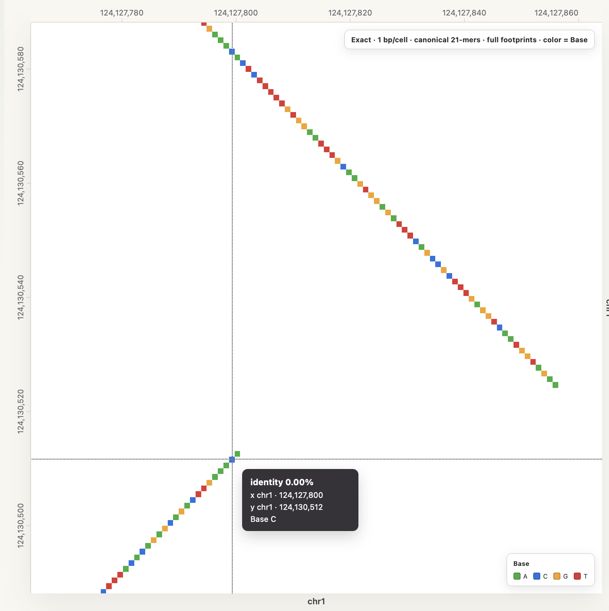

Hovering over a plot displays the X and Y sequence names, genomic intervals, and estimated identity for the cell beneath the pointer. Cursor guide lines can be configured or disabled in `Advanced options`.

`ModDotPlot Browser` supports three plot modes when multiple sequences are available:

- **Self plot** compares one selected sequence against itself. 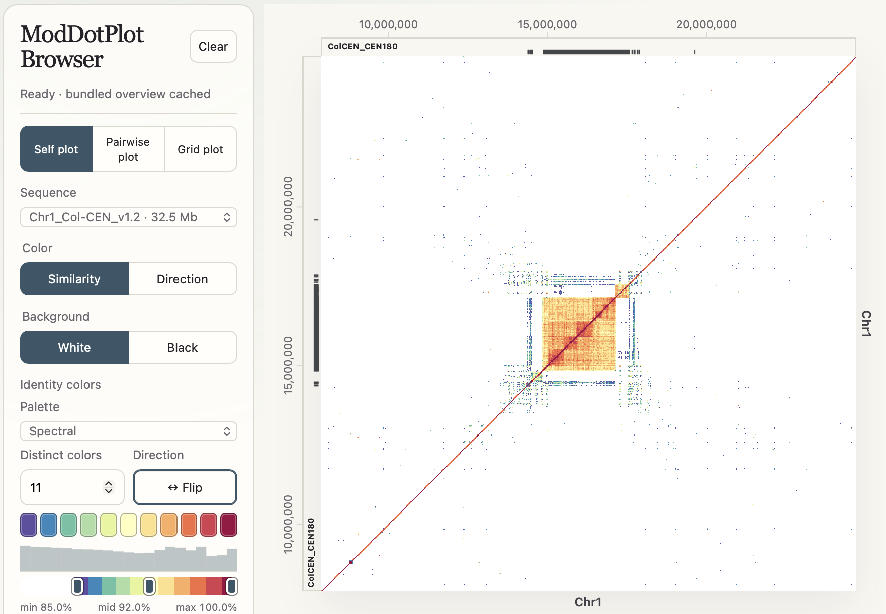
- **Pairwise plot** compares two different sequences. Use the X and Y selectors to control which sequence appears on each axis. 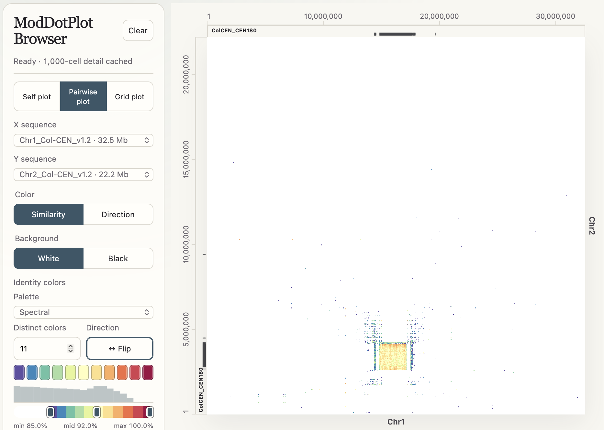
- **Grid plot** displays between two and six selected sequences. Self-comparisons appear along the diagonal running from the bottom left to the top right, while the remaining cells contain pairwise comparisons. 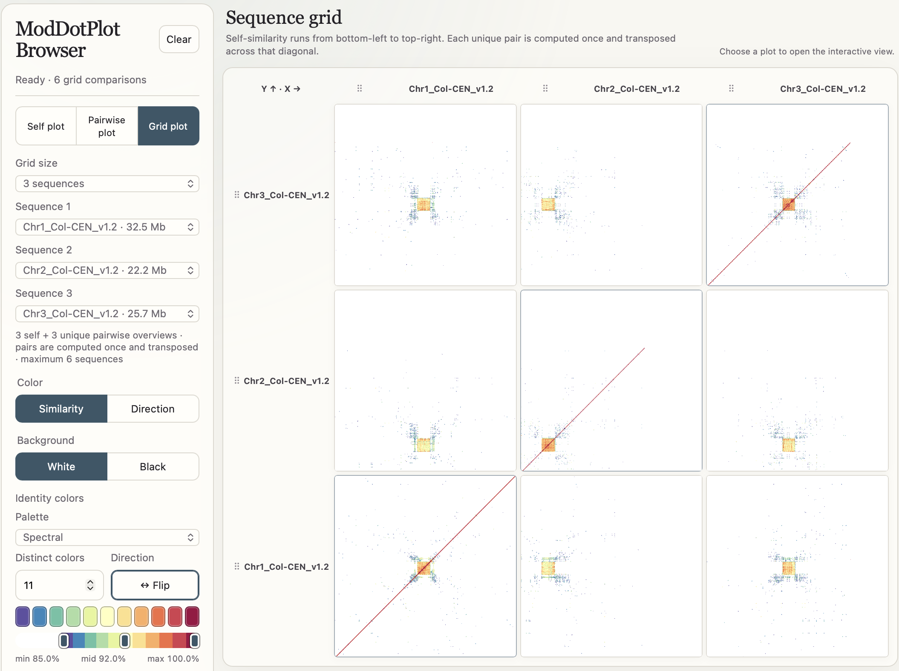

In Grid plot mode, select any cell to open it as a full interactive Self or Pairwise plot. Use the `Back to grid` button to return to the completed grid. Grid order can be changed by dragging a sequence label on either axis; changing one axis updates the other so that corresponding self-comparisons remain on the diagonal.

## Plot Resolution

Each pixel along an axis corresponds to a genomic interval of a given length, called the *window size* ($w$). Let $n$ be the chromosome length in base pairs and $r$ be the number of pixels spanning the chromosome along that axis. The window size is computed through the following formula:

$$
w = \frac{n}{r}
$$

A higher display resolution therefore corresponds to a smaller window size, with fewer base pairs represented by each pixel. `ModDotPlot Browser` has a default resolution of 1,000 × 1,000. While the window size cannot be modified directly, the resolution can be changed in the advanced settings panel:

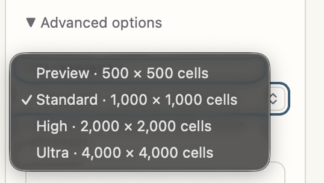

Rendering at a higher resolution requires more computation and memory. Because the number of cells grows with the square of the resolution, doubling both plot dimensions creates approximately four times as many cells. High and Ultra settings should therefore be used cautiously with large sequences, large grids, or computers with limited memory.

- $r = 500$ (250,000 cells, approximately 420 MB of memory) 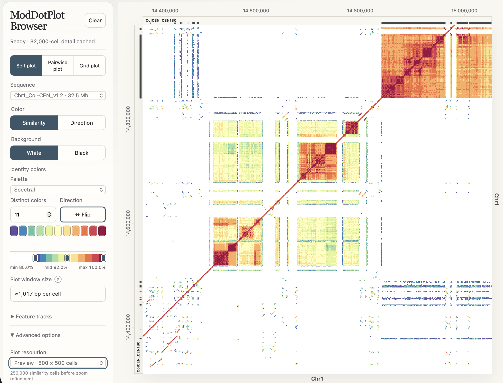
- $r = 4,000$ (16 million cells, approximately 1.16 GB of memory) 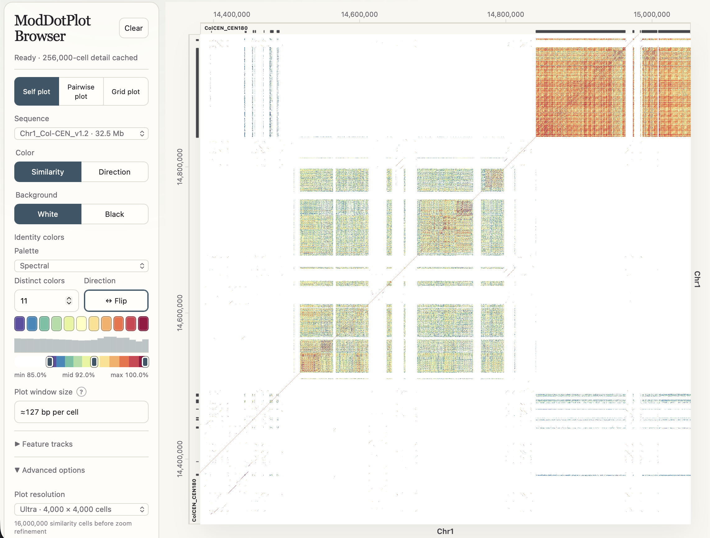

Additional non-aesthetic settings are available under `Advanced options`:

- **Quick-view accuracy** controls the sketch size used to generate the first responsive preview.
- **Detailed accuracy** controls the sketch size used for the refined result.
- ***K*-mer length** changes the *k*-mer size used in similarity estimation. Only odd values are allowed to prevent palindromes.

Increasing Quick-view or Detailed accuracy can improve estimator stability but requires more processing time and memory. Changing the *k*-mer length changes the scientific comparison itself and should be done deliberately.

## Plot Customization

The controls beside the plot can be used to change its appearance without reloading the input assembly.

The `Color` control provides two display modes:

- **Similarity** colors cells by estimated sequence identity (ANI).
- **Direction** distinguishes forward (blue) and reverse-orientation (pink) matches. Color intensity reflects the estimated identity.

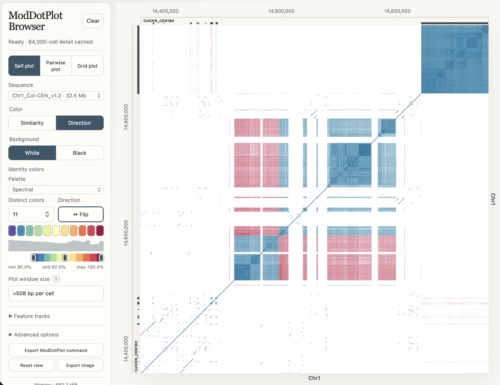

The plot background can be switched between white and black. Under `Identity colors`, the palette selector contains supported ColorBrewer palettes grouped by palette class, together with Spectral and Viridis options. Spectral is the default.

The identity color controls can be used to:

- Select the number of distinct palette colors.
- Reverse the palette with the `Flip` button.
- Adjust the minimum, midpoint, and maximum displayed identity values.
- Select an individual color swatch and replace it using a color picker or hexadecimal color code.

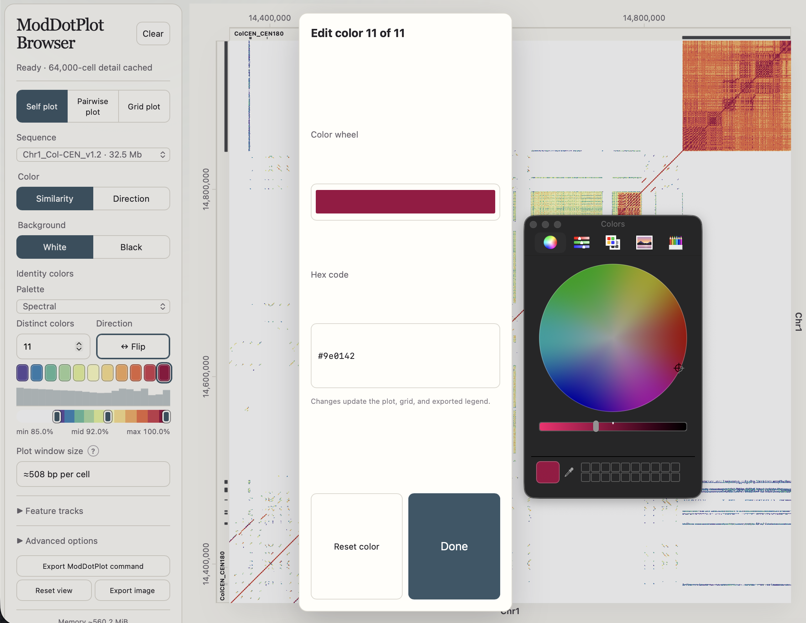

Adjusting these controls changes how the calculated values are displayed; it does not change the underlying similarity calculation.

The `Feature tracks` panel can display the following computed tracks on the X axis, Y axis, or both:

- **GC%:** average GC content in each visible genomic window.
- **CpG O/E:** observed-to-expected CpG ratio, displayed on a 0–2 scale.

BED, GFF3, and GTF annotation files can also be added from the landing page or with the `Add track` button. Plain-text, gzip-compressed, and BGZF-compressed annotations are supported. A multi-sequence annotation file is represented by one logical track, and features are automatically matched to the sequence currently displayed on each axis.

Use the `Track placement` controls to display X-axis tracks above or below the plot and Y-axis tracks to its left or right. The selected placement applies to computed and imported feature tracks.

Select `Export image` to save a high-quality rendering of the current interactive view. *Please do not use plots generated this way for official publications; use the validated [ModDotPlot CLI](https://github.com/marbl/ModDotPlot) instead.* Depending on browser support and the selected filename extension, plots can be exported as PNG, SVG, or PDF. Image exports include the visible axes, sequence labels, feature tracks, and legend. SVG and PDF exports retain vector axes, labels, tracks, and legends around the rasterized heatmap.

## Exporting Data to ModDotPlot CLI

As a reminder, ***this browser is meant for exploratory analysis only!*** Once you have styled a plot to your liking, select `Export ModDotPlot command` to download files for use in the [ModDotPlot CLI](https://github.com/marbl/ModDotPlot). The browser will finish preparing detailed data for the visible view and download a ZIP archive.

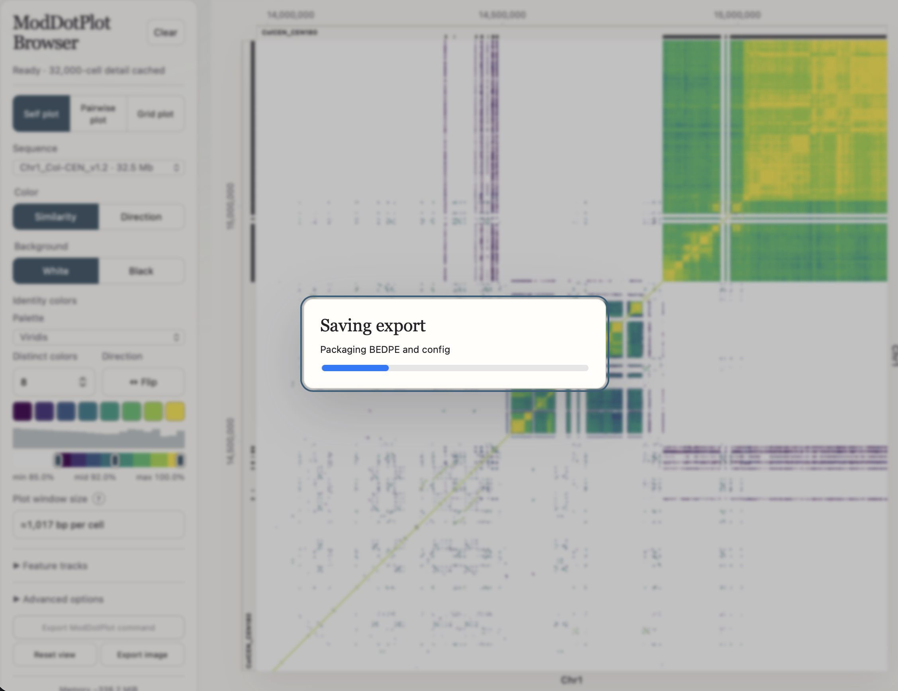

For a Self or Pairwise plot, the archive contains:

```text
<plot-name>.bedpe
<plot-name>.config.json
```

The BEDPE file contains the non-empty similarity cells from the exported view. The JSON configuration records the corresponding ModDotPlot display settings and refers to the BEDPE file through its `load` field.

Extract both files into the same directory:
```bash
unzip <plot-name>.zip
cd <plot-name>
```

The exported command can then be run with the official ModDotPlot CLI:
```bash
moddotplot -c <plot-name>.config.json -l <plot-name>.bedpe
```

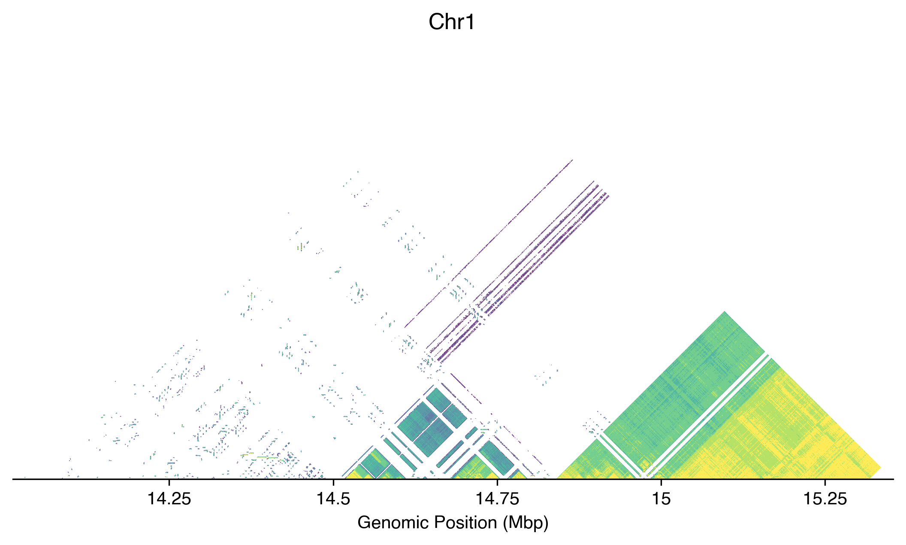
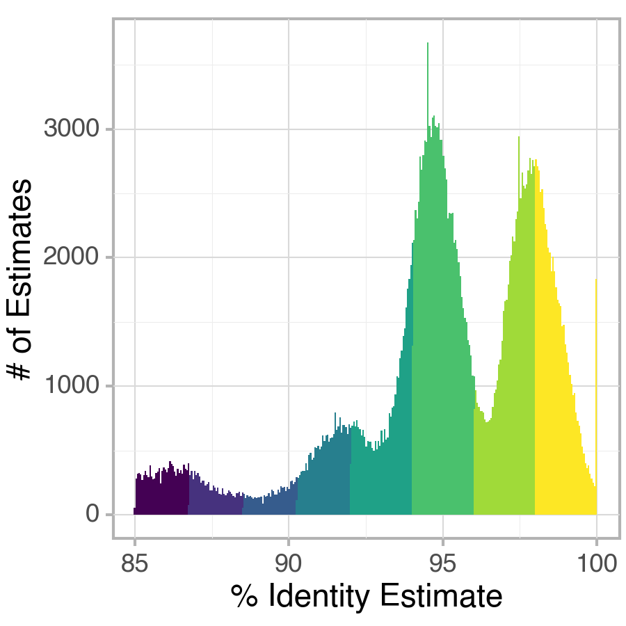

The actual exported filenames are written into the JSON metadata, so replace `<plot-name>` with the name of the downloaded package.

For a Grid plot, the ZIP archive contains one BEDPE file for every selected self-comparison and every unique pairwise comparison, together with a single configuration file. Run the exported grid with:

```bash
moddotplot --grid-only -c <grid-name>.config.json -l <self-and-pairwise-bedpe-files>
```
